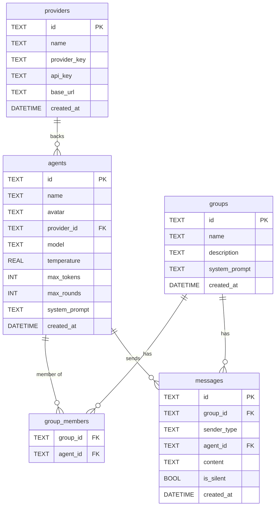

# OpenCircle Backend

## Tech Stack

- **FastAPI** — async web framework
- **SQLModel** — ORM (SQLAlchemy + Pydantic)
- **SQLite** — single-file database, zero config
- **uv** — package manager
- **SSE (Server-Sent Events)** — streaming chat responses to the frontend

---

## Installing opencircle-module

This backend depends on [`opencircle_module`](https://github.com/DeveshSoni973/opencircle-module) for all LLM orchestration.

### Development (local editable install)

Both repos sit as siblings under `C:\Codic\opencircle\`. Add this to `pyproject.toml` so uv resolves it from the local folder:

```toml
[project]
dependencies = [
    "opencircle-module",
]

[tool.uv.sources]
opencircle-module = { path = "../opencircle_module", editable = true }
```

Then install:

```bash
uv sync
```

Changes made to `opencircle_module` are immediately reflected — no reinstall needed.

### Production (install from GitHub)

Swap the source in `pyproject.toml`:

```toml
[tool.uv.sources]
opencircle-module = { git = "https://github.com/DeveshSoni973/opencircle-module.git" }
```

---

## Using opencircle-module in a Chat Endpoint

```python
from opencircle_module import Agent, GroupChat

# Build module Agent objects from DB rows
agents = [
    Agent(
        name=db_agent.name,
        model=db_agent.model,
        provider=db_provider.provider_key,
        api_key=db_provider.api_key,
        temperature=db_agent.temperature,
        max_tokens=db_agent.max_tokens,
        max_rounds=db_agent.max_rounds,
    )
    for db_agent, db_provider in agent_provider_pairs
]

# Seed history from persisted messages
from opencircle_module import Message as OCMessage

history = [
    OCMessage(
        sender_id=msg.agent_id if msg.sender_type == "agent" else "usr",
        content=msg.content,
        msg_id=msg.id,
    )
    for msg in existing_messages
]

# Run the group chat
gc = GroupChat(agents=agents, system_prompt=group.system_prompt or "default")
gc.history = history

new_messages = await gc.run(user_input)

# Persist new messages
for msg in new_messages:
    if not msg.is_silent:
        db.add(Message(
            id=msg.msg_id,
            group_id=group_id,
            sender_type="agent",
            agent_id=gc.registry.get_by_id(msg.sender_id).agent_id,
            content=msg.content,
        ))
```

---

## Database Design

SQLite database managed via SQLModel. All primary keys are UUID strings.

---

## Tables

### `providers`

Stores LLM provider credentials. One record = one API key. Multiple agents can share a single provider.

| Column | Type | Notes |
|---|---|---|
| `id` | TEXT PK | UUID |
| `name` | TEXT | Display name, e.g. `"My OpenAI Key"` |
| `provider_key` | TEXT | Enum: `openai`, `anthropic`, `groq`, `google`, `nvidia`, `openrouter` |
| `api_key` | TEXT | Raw API key |
| `base_url` | TEXT | Optional. For custom/self-hosted endpoints |
| `created_at` | DATETIME | Auto-set on insert |

---

### `agents`

Each row is a "person" in the chat — an LLM persona with a name, avatar, and model config.

| Column | Type | Notes |
|---|---|---|
| `id` | TEXT PK | UUID |
| `name` | TEXT | Display name shown in chat, e.g. `"Alice"` |
| `avatar` | TEXT | Emoji or image URL |
| `provider_id` | TEXT FK | → `providers.id` |
| `model` | TEXT | e.g. `"gpt-4o"`, `"claude-opus-5"` |
| `temperature` | REAL | Default `0.7` |
| `max_tokens` | INT | Default `1024` |
| `max_rounds` | INT | Per-agent round cap. Default `5` |
| `system_prompt` | TEXT | Optional. Template name or raw prompt text |
| `created_at` | DATETIME | Auto-set on insert |

---

### `groups`

A named collection of agents — the group chat room definition.

| Column | Type | Notes |
|---|---|---|
| `id` | TEXT PK | UUID |
| `name` | TEXT | Display name, e.g. `"Research Team"` |
| `description` | TEXT | Optional |
| `system_prompt` | TEXT | Optional. Overrides individual agent system prompts when set |
| `created_at` | DATETIME | Auto-set on insert |

---

### `group_members`

Join table linking agents to groups.

| Column | Type | Notes |
|---|---|---|
| `group_id` | TEXT FK | → `groups.id` |
| `agent_id` | TEXT FK | → `agents.id` |

**Primary key:** `(group_id, agent_id)`

---

### `messages`

Every message in a group — user messages and agent responses.

| Column | Type | Notes |
|---|---|---|
| `id` | TEXT PK | UUID (matches `msg_id` from `opencircle_module`) |
| `group_id` | TEXT FK | → `groups.id` |
| `sender_type` | TEXT | Enum: `"user"` or `"agent"` |
| `agent_id` | TEXT FK | → `agents.id`. NULL when `sender_type = "user"` |
| `content` | TEXT | Raw message content |
| `is_silent` | BOOL | `true` if the agent returned `[SILENT]` |
| `created_at` | DATETIME | Auto-set on insert |

---

## Relationships



---

## Design Notes

- **Provider ↔ Agent is one-to-many.** One API key can back multiple agent personas.
- **Messages belong directly to a group.** No conversations layer — each group has one continuous chat history.
- **`is_silent` is stored.** The frontend decides whether to render silent turns; data is never discarded.
- **No auth tables.** Standalone single-user app.

---

## Runtime Mapping (Backend → Module)

When a chat request comes in for `group_id`:

1. Load `group_members` → fetch `agents` rows → instantiate `opencircle_module.Agent` objects
2. Load `providers` for each agent → pass `api_key` and `provider_key` to `ProviderFactory`
3. Load existing `messages` for the group → reconstruct `opencircle_module.Message` list → seed `GroupChat.history`
4. Call `await group_chat.run(user_message)`
5. Persist returned messages back to the `messages` table
